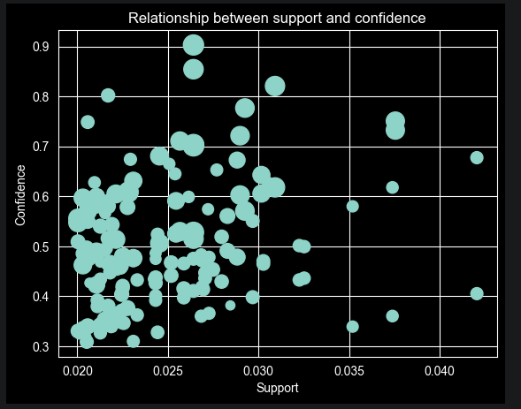

# Market Basket Analysis & Smart Retail Recommendation System
### Capstone Project Submission

---

## Project Summary

This project applies **market basket analysis** to a real-world UK online retail dataset to uncover which products customers buy together — and turns those findings into a live, interactive recommendation dashboard that any business user can query without writing a single line of code.

At its core, the project uses the **Apriori algorithm** to mine association rules from 18,668 customer transactions. Those rules power a **Streamlit web app** that, when given any product, returns:
- The top 3 products most frequently bought alongside it ("Frequently Bought Together")
- The top 3 cross-category products that the same customers also tend to buy ("Cross-Sell Opportunities")

The end result bridges the gap between data science output and practical business usability — a recommendation engine grounded in real purchasing behavior.

---

## What I Did to Create It

### Phase 1 — Data Exploration & Cleaning (Week 1)

The dataset (`OnlineRetail.csv`) contained **541,909 rows** representing individual line items across customer invoices. Before any modeling, I audited the data carefully:

- **Identified 1,454 null descriptions** — rows with no product name are useless for basket analysis, so they were dropped
- **Normalized whitespace** in product descriptions using a regex substitution (`re.sub(r'\s+', ' ', x).strip()`) to prevent duplicate item groupings from formatting inconsistencies
- **Removed cancelled transactions** — invoices prefixed with `"C"` represent returns and would inject negative signals into the model; all were excluded
- **Analyzed geographic distribution** — the UK accounted for 91.5% of all transactions, so the analysis was scoped to UK-only data to ensure purchasing patterns reflect a single coherent market

After cleaning, the dataset contained **531,167 rows** — a conservative clean that preserved as much original data as possible.

> **Screenshot 1: Jupyter Notebook — Initial Data Inspection**
> *(Add a screenshot of the df.describe() / df.isnull().sum() output from the notebook)*

---

### Phase 2 — Transaction Matrix Construction

UK transactions were reshaped into a **binary transaction matrix**: 18,668 invoices × 4,134 unique products. Each cell is `1` if the product appeared in that invoice, `0` otherwise.

Key decisions:
- Binarized quantities (presence/absence only — how many units were bought doesn't matter for basket analysis)
- Removed non-product columns: `POSTAGE`, `DOTCOM`, `CARRIAGE`, `MANUAL` — these are operational entries, not purchasable goods

> **Screenshot 2: Jupyter Notebook — Transaction Matrix Construction & Binarization**
> *(Add a screenshot of the uk_df.head() output showing the 0/1 binary matrix)*

---

### Phase 3 — Frequent Itemset Mining & Rule Generation

I applied the **Apriori algorithm** using the `mlxtend` Python library with an initial minimum support of 2%, which produced **368 frequent itemsets** and **155 association rules**.

During dashboard development it became clear that a 2% threshold left too many products without recommendations — many products appeared in fewer than 2% of baskets individually, so no rules were generated for them. The threshold was lowered to **1.5%** to ensure full product coverage. Because Apriori ran out of memory at the lower threshold on this dataset size, **FP-Growth** (an equivalent algorithm that uses a compressed tree structure instead of candidate generation) was used to regenerate the rules. FP-Growth produces identical rules to Apriori at the same threshold — only the computation method differs.

The final rule set used by the app:
- **Minimum support: 1.5%** — itemsets must appear in at least 1.5% of all UK transactions
- **692 frequent itemsets**
- **2,795 association rules** across 14 metrics (support, confidence, lift, leverage, conviction, and more)
- **241 products** with full recommendation coverage

Rules are applied in two tiers within the dashboard:

| Tier | Ranking metric | Purpose |
|------|---------------|---------|
| Frequently Bought Together | Confidence (desc) | Products most reliably bought in the same basket |
| Cross-Sell Opportunities | Lift (desc) | Products with the strongest statistical association beyond chance |

The cross-sell tier added a **word-overlap heuristic**: if the antecedent and consequent product names share no significant words (words longer than 4 characters, excluding generic descriptors like "large", "small", "design"), the pair is classified as a genuine cross-category recommendation rather than just a product variant.

> **Screenshot 3: Jupyter Notebook — Top 10 Association Rules Sorted by Lift**
> *(Add a screenshot of the strong_rule sorted table showing Regency Teacup and Charlotte Bag rules)*

---

### Phase 4 — Visualization

I visualized the relationship between **support and confidence** across the initial 155 rules (at 2% support), with bubble size representing lift strength. This scatter plot revealed clustering patterns — most high-confidence rules sit in the lower support range (2–3%), indicating strong but niche associations rather than globally common pairings.

**Support vs. Confidence Scatter Plot (Initial 155 Rules at 2% Support):**

*Each bubble represents one association rule. Bubble size corresponds to lift — larger means the pairing is more statistically meaningful above random chance. High-confidence rules are visible in the upper-left cluster, representing strong but narrow associations.*

---

### Phase 5 — Dashboard Development

The analytical findings were deployed as an interactive web application using **Streamlit**. The app reads the exported `rules.csv` and provides a product dropdown that any user can interact with — no data science knowledge required.

**Technology stack:**
- Python 3.x
- `pandas` — data manipulation
- `mlxtend` — Apriori algorithm and rule generation
- `streamlit` — interactive web app framework
- Custom CSS — gradient hero banner, dark sidebar, card-based layout

**Dashboard architecture:**
- **Sidebar**: shows total products available and total rules mined, with threshold reference
- **Hero banner**: contextualizes the tool with a live rule count
- **Section 1 — Frequently Bought Together**: top 3 products by support + lift with gold/silver/bronze ranking and metric pills
- **Section 2 — Cross-Sell Opportunities**: top 3 cross-category products ranked by lift with a distinct teal card design
- **Legend**: explains support, confidence, and lift in plain English for business users

> **Screenshot 4: Dashboard — Empty State / Landing View**
> *(Add a screenshot of the app before a product is selected, showing the hero banner, sidebar, and "How to use" info box)*

> **Screenshot 5: Dashboard — "Frequently Bought Together" Section**
> *(Add a screenshot with a product selected, e.g., "PINK REGENCY TEACUP AND SAUCER", showing the three recommendation cards with metric pills)*

> **Screenshot 6: Dashboard — "Cross-Sell Opportunities" Section**
> *(Add a screenshot showing the teal cross-sell cards for a product with cross-category results)*

---

## Highlights of the Project (Favorite Parts)

### Favorite Part 1 — The Association Rule Results

The strongest rules in the dataset told a genuinely interesting story. The top-lift rule — `PINK REGENCY TEACUP AND SAUCER → {GREEN REGENCY TEACUP AND SAUCER, ROSES REGENCY TEACUP AND SAUCER}` — achieved a lift of **18.68**. That means this pairing is over 18 times more likely than if the three items were purchased independently at random.

What I found fascinating is what this *means* behaviorally: customers aren't randomly picking teacups — they're deliberately **completing a collection**. That's a different kind of signal than simple co-purchase. The data revealed intentional, goal-directed shopping, which is a far richer insight than I expected from a simple algorithm.

The Charlotte Bag results were equally revealing — customers building coordinated bag sets across the Woodland, Strawberry, Pink Polkadot, and Suki variants, with lifts ranging from 14.0 to 15.2.

*This scatter plot was a key analytical step — it showed that the strongest rules (largest bubbles = highest lift) cluster in the moderate support range, not at the extremes. Rules with support above 0.035 and high confidence tend to be the collection-completion behaviors. This initial analysis at 2% support informed the decision to lower the threshold to 1.5% for the final app, capturing more product associations while the clustering pattern remained consistent.*

### Favorite Part 2 — The Cross-Sell Detection Logic

The `is_cross_sell()` function is simple but surprisingly effective. By checking whether two product names share any significant keyword (ignoring short words and generic descriptors), it distinguishes:

- **PINK REGENCY TEACUP** → **GREEN REGENCY TEACUP**: same family (not cross-sell — both contain "REGENCY" and "TEACUP")
- **JUMBO BAG PINK POLKADOT** → **JUMBO BAG RED RETROSPOT**: within-family pairing (shares "JUMBO" and "BAG")
- **ROSES REGENCY TEACUP** → **REGENCY CAKESTAND 3 TIER**: this one is interesting — shares "REGENCY" but represents a functional expansion (cup → cake stand), a genuine cross-sell opportunity

The heuristic isn't perfect, but for a keyword-rich product catalog like this one, it draws a meaningful and useful line.

### Favorite Part 3 — The Dashboard UI

Replacing Streamlit's default layout with a custom CSS styling system was deeply satisfying. The gradient hero banner, dark sidebar, and tiered card design (gold/silver/bronze for ranked recommendations, teal for cross-sell) make the output feel like a real product — not a data science exercise. The decision to surface the metric pills (support, confidence, lift) directly on each card means business users get the evidence alongside the recommendation, which builds trust in the output.

> **Screenshot 7 (Optional): Dashboard — Sidebar Detail**
> *(Add a close-up of the sidebar showing the rule count and threshold indicators)*

---

## Conclusion

### What I Learned

**Association rule mining is deceptively interpretable.** Support, confidence, and lift are three numbers, but they encode genuinely meaningful behavioral signals. Learning to read them together — not just pick the highest lift — taught me how to translate statistical output into business insight.

**Data cleaning is analytical design.** The decisions made before any model runs — which rows to drop, how to normalize, which columns to exclude — determine what the model can and cannot see. Choosing to binarize quantities rather than preserve counts, for example, was not an obvious call. Getting comfortable with those judgment calls was one of the most valuable skills I developed.

**Presentation is part of the analysis.** A recommendation engine that only a data scientist can query isn't a recommendation engine — it's a research artifact. Building the Streamlit dashboard forced me to think about what business users actually need to see and how to communicate statistical metrics without statistical jargon.

**AI-assisted development is a real workflow.** Collaborating with Claude on the dashboard's UI architecture, CSS system, and cross-sell logic was genuinely productive. It shifted time from implementation details to higher-level decisions about what the tool should do and why.

---

### What I Did Well

- **The full pipeline.** I took this from raw CSV to a deployed, interactive web application — end-to-end. That's the complete data product lifecycle: understand the data, clean it, model it, interpret the results, and make them accessible.
- **Keeping the cleaning conservative.** I only removed records that genuinely couldn't contribute to basket analysis. Aggressive cleaning would have shrunk the dataset and potentially hidden real purchasing patterns.
- **The two-tier recommendation architecture.** Separating "Frequently Bought Together" from "Cross-Sell Opportunities" wasn't the obvious first design. It required recognizing that bundle promotion and category expansion serve different business objectives and should be surfaced differently.
- **The written report.** The `report.md` document provides an academic-quality explanation of every methodological decision — not just what was done, but why, and what the limitations are.

---

### What I Could Have Done Better

- **Temporal analysis.** The dataset spans a full year, but I treated all transactions as a single undifferentiated pool. Splitting by season (e.g., Q4 holiday vs. Q1 off-peak) would likely reveal very different association patterns and enable seasonal recommendation tuning.
- **The support threshold.** I initially settled at 2%, but this left too many products without recommendations in the dashboard. Lowering to 1.5% resolved the coverage gap and expanded the rule set from 155 to 2,795 rules across 241 products. Going further — to 0.5% or lower — might surface meaningful niche patterns, but would require a more memory-efficient implementation pipeline.
- **The cross-sell heuristic.** The word-overlap function works reasonably well on this dataset, but it's a surface-level text match. Products that share incidental words (like "RED" in "ALARM CLOCK BAKELIKE RED" and "JUMBO BAG RED RETROSPOT") can be misclassified. A product taxonomy or embedding-based approach would be more robust.
- **Visualizations.** The scatter plot I produced is informative but minimal. A lift network graph showing which products cluster together, or a heatmap of the strongest rule pairs, would have communicated the findings more powerfully.

---

### Main Takeaway

The most useful thing I will carry forward from this project is how to **move from analysis to artifact** — the discipline of not stopping at findings, but continuing until those findings are in a form that someone else can actually use.

Data science is too often treated as ending at the results table. This project made concrete that the results table is the middle, not the end. The recommendation engine is only valuable because someone who has never opened a Jupyter notebook can pick a product from a dropdown and immediately see actionable intelligence. Building that bridge — between what the data says and what a business can do with it — is the skill I want to keep developing.

---

## Technical Reference

| Item | Detail |
|------|--------|
| Dataset | UK Online Retail (UCI Machine Learning Repository) |
| Raw rows | 541,909 |
| After cleaning | 531,167 |
| UK transactions (invoices) | 18,668 |
| Products in matrix | 4,134 |
| Frequent itemsets — initial (≥ 2% support, Apriori) | 368 |
| Association rules — initial (≥ 30% confidence) | 155 |
| Frequent itemsets — final (≥ 1.5% support, FP-Growth) | 692 |
| Association rules — final (≥ 20% confidence) | 2,795 |
| Products with full recommendation coverage | 241 |
| Top lift achieved | 18.68× (Regency Teacup collection) |
| Language | Python 3.x |
| Key libraries | pandas, mlxtend, streamlit, matplotlib |
| Dashboard | Streamlit (local), `app.py` |
| Analysis | Jupyter Notebook, `notebooks/eda.ipynb` |

---

*Project by Chikamso Ezeaku — Market Basket Analysis & Smart Retail Recommendations*
